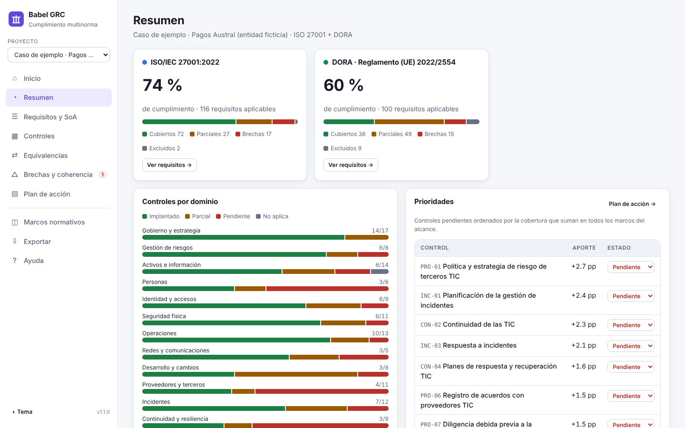
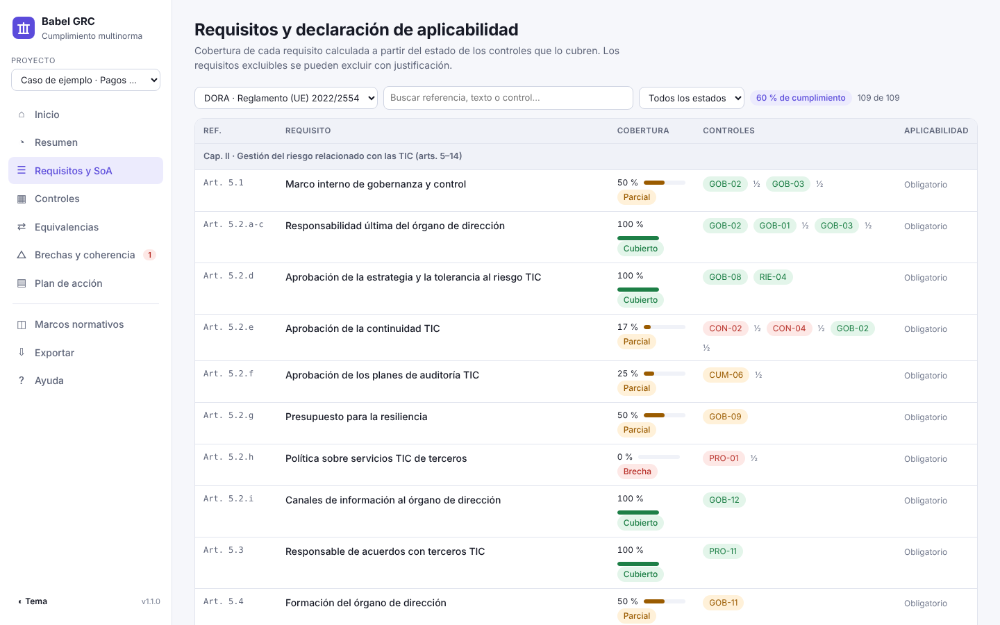
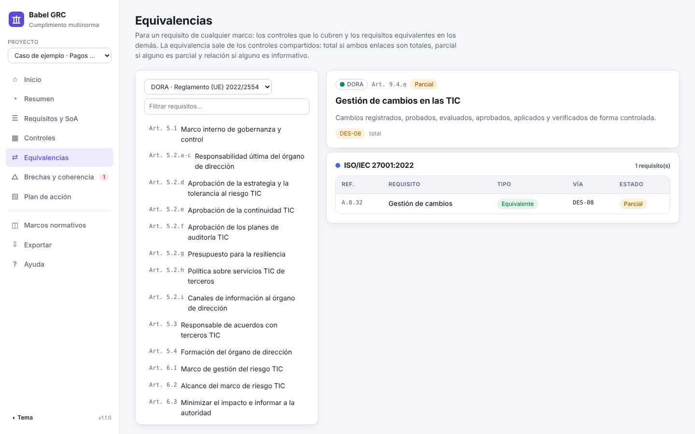
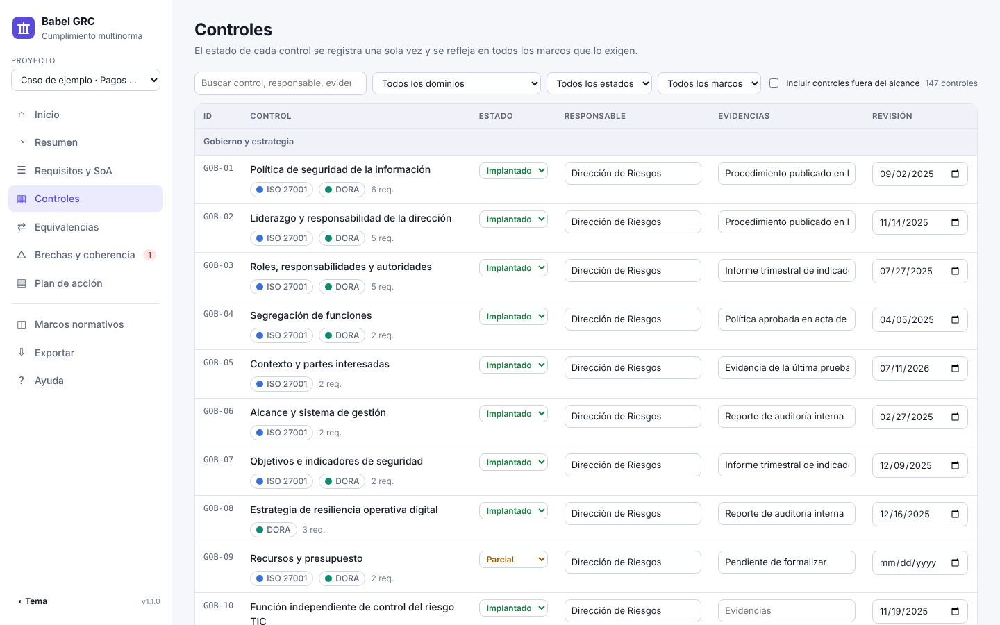
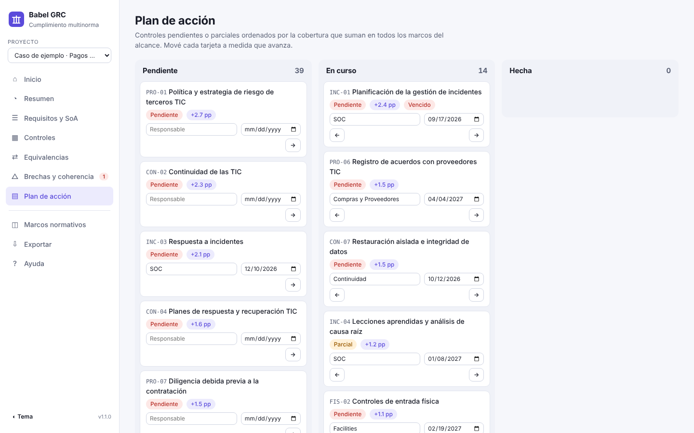
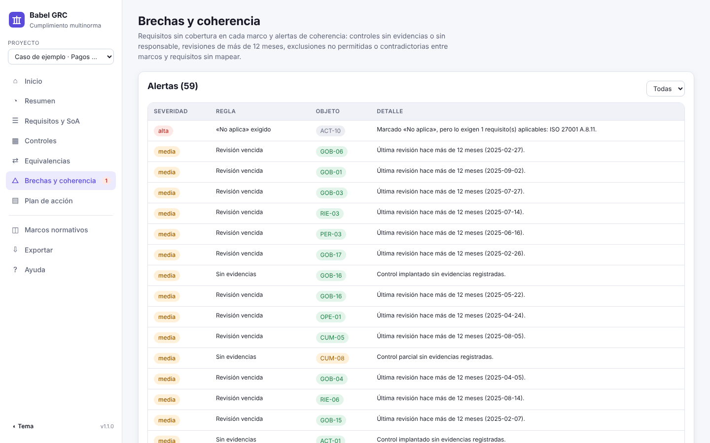
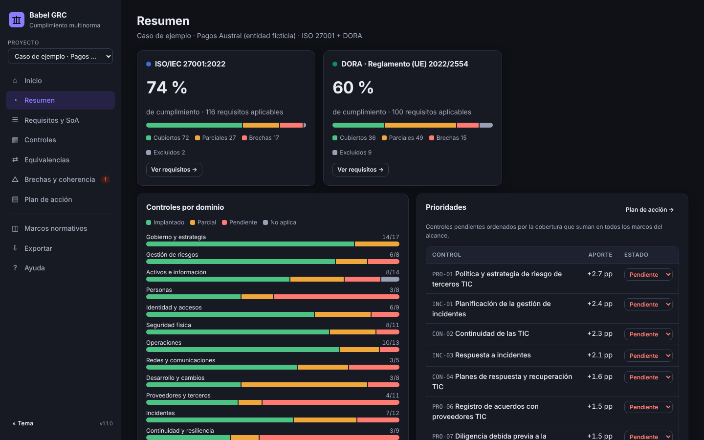
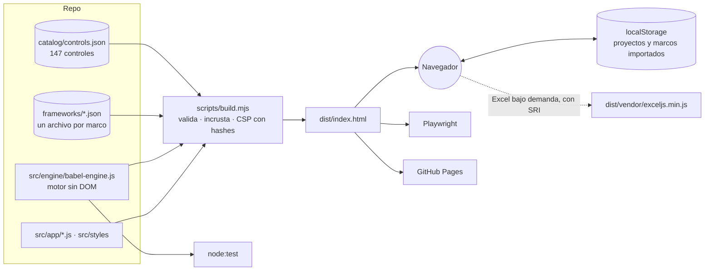

# Babel GRC

**Herramienta de cumplimiento multinorma.** Relaciona los requisitos de varios marcos normativos con un **catálogo común de controles**, registra el estado de cada control una sola vez y calcula el grado de cumplimiento de cada marco, las equivalencias entre marcos, las brechas y el orden de implantación.

Arranca con **ISO/IEC 27001:2022** y **DORA (Reglamento UE 2022/2554)**. Además, **acepta marcos nuevos en cualquier momento**, desde la aplicación (Excel o JSON) o desde el repositorio.

[**▶ Abrir Babel GRC**](https://martinboratto.github.io/babel-grc/) · Funciona en el navegador, sin servidor y sin conexión. Los datos no salen del equipo.

   



```
babel-grc
├─ marcos:      ISO/IEC 27001:2022 (118 requisitos) · DORA (109 requisitos) · + los que agregues
├─ catálogo:    147 controles unificados en 14 dominios
├─ cálculo:     cobertura ponderada · equivalencias · solapamiento · 10 reglas de coherencia · plan priorizado · fotos del período verificables
├─ aplicación:  HTML + CSS + JavaScript sin framework · un único index.html · tema claro y oscuro · móvil
├─ pruebas:     node:test (29) · Playwright E2E (10)
└─ seguridad:   CSP con hashes · SRI · cero peticiones a terceros · neutralización de fórmulas
```

## Índice

- [Cómo se usa](#cómo-se-usa)
- [Agregar un marco normativo nuevo](#agregar-un-marco-normativo-nuevo)
- [Vistas](#vistas)
- [Método de cálculo](#método-de-cálculo)
- [Arquitectura](#arquitectura)
- [Desarrollo](#desarrollo)
- [Seguridad y privacidad](#seguridad-y-privacidad)
- [Limitaciones](#limitaciones)
- [Licencia y autor](#licencia-y-autor)

## Cómo se usa

1. **Proyecto.** En *Inicio*, creá un proyecto y elegí los marcos de su alcance. También podés cargar el caso de ejemplo (una entidad de pago ficticia).
2. **Controles.** Registrá el estado de cada control (implantado, parcial, pendiente o no aplica), con responsable, evidencias, fecha de revisión y fecha objetivo. Cada cambio recalcula todos los marcos.
3. **Requisitos y SoA.** Revisá la declaración de aplicabilidad de cada marco. Lo que no aplique se excluye con justificación, solo si el requisito admite exclusión (por ejemplo, las cláusulas 4–10 de ISO 27001 no la admiten).
4. **Revisión.** Usá *Equivalencias*, *Brechas y coherencia* y el *Plan de acción*, ordenado por el aporte de cada control en todos los marcos.
5. **Foto del período.** En *Exportar*, congelá el estado del proyecto como prueba de un período: un Excel para presentar y un JSON verificable, ambos con el mismo código SHA-256. Después, *Verificar una foto* confirma que no se modificó y la compara con el estado actual o con otra foto.
6. **Entrega.** Exportá un Excel con la SoA de cada marco, controles, plan y alertas, o un informe en Markdown, un CSV, el proyecto en JSON o una copia de seguridad.

## Agregar un marco normativo nuevo

Un marco es un archivo JSON con sus requisitos. Cada requisito se enlaza con controles del catálogo común con una fuerza: **total**, **parcial** o **relación**. Como todos los marcos comparten el catálogo, uno nuevo se integra de inmediato con el cálculo, las equivalencias, las brechas y el plan.


### Opción A · Desde la aplicación (en tu navegador)

1. *Marcos normativos* › **Plantilla Excel** (o descargá [`templates/plantilla-marco.xlsx`](templates/plantilla-marco.xlsx)).
2. Completá las hojas **Marco**, **Grupos** (opcional) y **Requisitos**. En `controles_total`, `controles_parcial` y `controles_relacion` escribí los ids del catálogo separados por coma. La hoja **Catalogo** los lista todos.
3. Si un requisito necesita un control que no existe, definilo en la hoja **Controles_nuevos** (por ejemplo, `AIG-01`).
4. Arrastrá el archivo a **Agregar un marco**. Se valida (ids únicos, controles existentes, fuerzas válidas) y, si no hay errores, queda disponible al instante.
5. Los requisitos que queden sin mapear se completan con **Editar mapeos**.

### Opción B · En el repositorio (disponible para todos)

1. Exportá el marco en JSON desde su tarjeta en la aplicación, o convertí la plantilla:

   ```bash
   npm run xlsx-a-marco -- ruta/a/mi-marco.xlsx      # escribe frameworks/<id>.json
   ```

2. Subí el archivo a [`frameworks/`](frameworks/), desde la web de GitHub (*Add file › Upload files*) o con git.
3. GitHub Actions valida el marco, ejecuta las pruebas y publica la nueva versión del sitio.

La guía completa, con el formato y los criterios de mapeo, está en [`frameworks/README.md`](frameworks/README.md). El esquema es [`schema/framework.schema.json`](schema/framework.schema.json).

## Vistas

| Vista | Contenido |
|---|---|
| **Resumen** | Cumplimiento por marco, controles por dominio, prioridades, alertas y matriz de solapamiento entre marcos. |
| **Requisitos y SoA** | Declaración de aplicabilidad de cada marco: cobertura por requisito, controles enlazados y exclusiones justificadas. |
| **Controles** | Los controles del alcance con estado, responsable, evidencias y revisión; panel de detalle con los requisitos que cubre cada uno. |
| **Equivalencias** | Para un requisito de cualquier marco, sus controles y los requisitos equivalentes en los demás (total, parcial o relación). |
| **Brechas y coherencia** | Requisitos sin cubrir y 10 reglas: sin evidencias, sin responsable, sin revisión o revisión de más de 12 meses, «no aplica» exigido, plazo vencido, exclusiones no permitidas, sin justificar o contradictorias entre marcos, y requisitos sin mapear. |
| **Plan de acción** | Tablero Pendiente / En curso / Hecha, ordenado por puntos de cumplimiento que aporta cada control. |
| **Marcos normativos** | Alcance, importación y validación de marcos, plantillas, editor de mapeos y exportación JSON/Excel. |
| **Exportar** | Foto del período (Excel + JSON con código de verificación), verificación y comparación de fotos; Excel, Markdown, CSV, JSON y copia de seguridad completa. |

| | |
|---|---|
|  |  |
|  |  |
|  |  |

## Método de cálculo

Cada requisito se enlaza con controles con un peso **w**: 1 (total), 0,5 (parcial) o 0 (relación, informativa). El estado del control vale 1 (implantado), 0,5 (parcial) o 0 (pendiente o no aplica).

```
cobertura(r) = max(w) · Σ(w · estado) / Σ w
```

- **Cubierto** al 100 %, **parcial** entre 0 y 100 %, **brecha** en 0. Un requisito con solo enlaces parciales no supera el 50 %. Si un requisito no tiene enlaces con peso, queda **sin mapear**.
- **Cumplimiento del marco**: promedio de la cobertura de los requisitos aplicables. Los excluidos no cuentan.
- **Prioridad** de un control pendiente: puntos porcentuales que suma en todos los marcos del alcance si se implanta.
- **Equivalencia** entre requisitos de marcos distintos: existe si comparten un control. Su fuerza es la menor de los dos enlaces.
- **Solapamiento A → B**: parte de B cubierta al implantar los controles que A exige con enlace total.

## Arquitectura



- **Sin framework ni dependencias en ejecución.** JavaScript plano, plantillas y delegación de eventos (`data-act`). La librería de Excel ([ExcelJS](https://github.com/exceljs/exceljs), MIT) se carga solo al importar o exportar Excel.
- **Motor independiente de la interfaz.** `babel-engine.js` funciona en el navegador y en Node, y se prueba sin navegador.
- **Marcos como datos.** Agregar un marco no requiere tocar código.

## Desarrollo

Requiere Node.js 20 o superior.

```bash
git clone https://github.com/martinboratto/babel-grc.git
cd babel-grc
npm ci
npm run build        # src/ + catalog/ + frameworks/ → dist/
npm run serve        # http://localhost:5173
```

| Comando | Qué hace |
|---|---|
| `npm run validate` | Valida el catálogo y todos los marcos de `frameworks/`. |
| `npm run build` | Genera `dist/index.html` (aplicación completa en un fichero) y `dist/vendor/`. |
| `npm test` | Motor, marcos y build (`node:test`). |
| `npm run test:e2e` | Aplicación en Chromium: flujos, importación JSON y Excel, exportaciones, CSP y móvil. Requiere `npx playwright install chromium`. |
| `npm run xlsx-a-marco -- archivo.xlsx` | Convierte una plantilla Excel en `frameworks/<id>.json`. |
| `npm run plantilla` | Regenera `templates/plantilla-marco.xlsx`. |

```
babel-grc/
├─ catalog/controls.json        catálogo común de controles y dominios
├─ frameworks/                  un JSON por marco (ISO 27001, DORA, …) + guía
├─ schema/                      esquemas JSON de marco y catálogo
├─ src/engine/                  motor de cálculo (UMD, sin DOM)
├─ src/app/                     interfaz (vistas, marcos, E/S, ayuda)
├─ src/styles/ · src/data/      estilos y caso de ejemplo
├─ scripts/                     build, validación, conversión Excel → JSON, servidor
├─ templates/                   plantilla Excel para marcos nuevos
├─ tests/                       pruebas del motor, marcos, build y E2E
└─ .github/workflows/           CI y publicación en GitHub Pages
```

## Seguridad y privacidad

- Sin servidor, cuentas ni telemetría. Los proyectos y los marcos importados se guardan en el `localStorage` del navegador. Exportá copias de seguridad.
- **Content-Security-Policy** con hashes SHA-256 de cada bloque: sin `unsafe-inline`, `connect-src 'none'` y ningún recurso de terceros.
- La librería de Excel se sirve desde el mismo origen con **SRI** (SHA-384).
- Los archivos importados se validan y normalizan: tipos, longitudes y referencias. Todo el texto se escapa al mostrarse.
- Las exportaciones a CSV y Excel neutralizan fórmulas (`=`, `+`, `-`, `@`).

Más detalle en [SECURITY.md](SECURITY.md).

## Limitaciones

- Los **mapeos son criterio del autor**, basados en el texto de cada marco. Revisalos con tu equipo antes de usarlos como evidencia de auditoría.
- **ISO/IEC 27001**: los títulos y resúmenes son propios y no reproducen el texto de la norma, protegido por derechos de autor de ISO.
- **DORA**: modela el articulado (arts. 5–30 y 45). No incluye las normas técnicas de regulación (RTS/ITS) ni el marco simplificado del art. 16.
- Ayuda a gestionar el cumplimiento, pero no lo certifica ni sustituye el juicio profesional.

## Licencia y autor

[MIT](LICENSE) © 2026 Martín Boratto. ExcelJS se distribuye con su propia licencia MIT (`dist/vendor/exceljs.LICENSE.txt`).

Inspirado en [Rosetta multinorma](https://github.com/heindall92/rosetta_multinorma), de heindall92. Babel GRC es una implementación independiente, con otro catálogo y otro enfoque: los marcos se agregan como datos.
